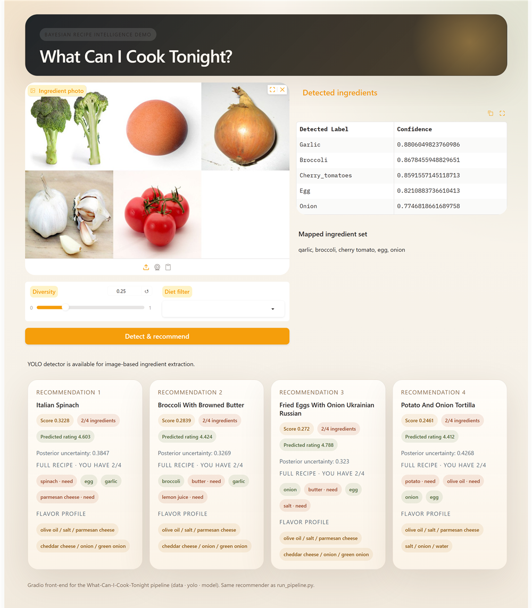
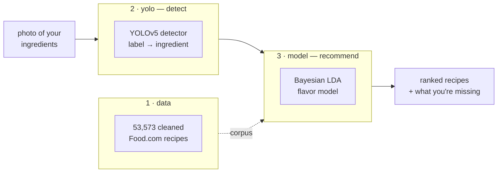

# 🍳 What Can I Cook Tonight?


Snap a photo of what's in your fridge and get the **recipes you can actually make tonight** — ranked by a Bayesian flavor model that also tells you how confident it is.

Bayesian Methods Final Project — by **Qixin Cui**, **Kevin Fan**, **Yizhuo Li**, **Elaine Wang**, and **Zhetao Zhang** (University of Chicago).



> *Upload a fridge photo → the detector spots the ingredients → the recommender returns ranked recipes, each with its full ingredient list and what you're still missing.*

<details>
<summary><b>Table of Contents</b></summary>

- [Features](#features)
- [Architecture](#architecture)
- [The idea](#the-idea)
- [Ranking recipes](#ranking-recipes)
- [Methodology](#-methodology)
  - [Stage 1 · Data](#stage-1--data)
  - [Stage 2 · Detection](#stage-2--detection)
  - [Stage 3 · Recommender](#stage-3--recommender)
- [Project structure](#project-structure)
- [Installation](#installation)
- [Usage](#usage)
- [Authors](#authors)
- [Acknowledgments](#acknowledgments)
- [License](#license)

</details>

---

# 📌 Overview

## Features

- 📷 **Photo → ingredients** — a Hugging Face Fine-Tuned YOLOv5 detector (95 ingredient classes) reads a fridge or counter photo.
- 🧠 **Recommendations with confidence** — a Bayesian flavor model ranks recipes *and* reports how sure it is.
- 🧾 **The whole recipe at a glance** — every suggestion lists all the ingredients it needs and flags the ones you're missing.
- 🥗 **Real-life filters** — vegetarian / vegan, "must use this", and a diversity dial so you don't get five near-identical dishes.
- 🖥️ **Web app *and* command line** — a friendly Gradio UI and a one-line command, both running the exact same engine.
- 📚 **53,573 real recipes** — cleaned from the public Food.com dataset.

## Architecture

Three stages, one entry point: a photo goes in, ranked recipes come out.



| Stage | Folder | What it does | Tech |
|-------|--------|--------------|------|
| 1 · Data | `data/` | Download and clean the Food.com corpus → `recipes_clean.csv` | pandas · kagglehub |
| 2 · Detect | `yolo/` | Spot ingredients in a photo, map labels to the recipe vocabulary | YOLOv5 · PyTorch · OpenCV · RapidFuzz |
| 3 · Recommend | `model/` | Rank recipes with a Bayesian flavor model | scikit-learn · NumPy · SciPy |
| — | `app.py` · `run_pipeline.py` | Web UI and CLI over the same engine | Gradio |

**Tech stack:** Python 3.13 · scikit-learn (LDA) · YOLOv5 (PyTorch) · Gradio · OpenCV · pandas / NumPy / SciPy.

---

# 🍳 How it works

## The idea

You open the fridge, see a handful of ingredients, and wonder what you can actually cook tonight. We wanted an answer that only suggests dishes you can **mostly make right now** — and that is **honest about how confident it is**. That second goal, uncertainty, is what makes this a Bayesian project.

The trick is to treat cooking like language: a **recipe is a document**, an **ingredient is a word**, and a **cuisine or flavor is a hidden theme**. A topic model (**LDA**) discovers those flavor themes on its own across the whole corpus — one theme leans on olive oil, basil and parmesan; another on flour, sugar and eggs.

Learning these themes the *fully* Bayesian way doesn't scale to tens of thousands of recipes, so we make a pragmatic trade: learn them **once** over all 53,573 recipes, then **re-learn them many times on resampled recipes** to see how much they wobble. They barely move — with this much data the flavor themes are pinned down — which is itself an honest result, not something we paper over.

## Ranking recipes

Every recipe you could make gets a score that blends four common-sense factors, so no single one can win on its own:

- **Can you make it?** How much of the recipe you already have. A dish you can't make is useless, so this counts the most.
- **Real overlap, not technicalities.** A 3-ingredient recipe shouldn't win just because you happen to have all three — bigger, genuine matches are rewarded.
- **Flavor fit.** Does the recipe's flavor theme match the one your ingredients suggest?
- **A rating you can trust.** A dish with a single 5-star vote is nudged toward the average, so one lucky rating can't top the list.

On top of that you can ask for **vegetarian / vegan** only, force a **must-use** ingredient, or turn up **diversity** so the list isn't five variations of the same dish.

That's the intuition. The **[Methodology](#-methodology)** section below makes it precise — and covers the data and detection stages too.

---

# 🔬 Methodology

> A recipe is a **document**, an ingredient is a **word**, and a cuisine or flavor is a latent
> **topic** — so we model the corpus with **Latent Dirichlet Allocation (LDA)** and turn the learned
> flavor topics into recommendations *that carry their own uncertainty*.

The pipeline is three stages, and each makes one deliberate methodological choice. This is the
precise version of [How it works](#the-idea); the per-stage deep dives live in
**[`yolo/README.md`](yolo/README.md)** and **[`model/README.md`](model/README.md)**.

## Stage 1 · Data

We build the corpus from the public [Food.com](https://www.kaggle.com/datasets/shuyangli94/food-com-recipes-and-user-interactions)
dump (`RAW_recipes.csv` + `RAW_interactions.csv`) in [`data/prepare_data.py`](data/prepare_data.py):

1. **Aggregate ratings** per recipe from the interactions file (streamed in chunks): a count
   `n_ratings` and a weighted mean `avg_rating`.
2. **Filter for signal** — keep recipes with **≥ 5 ratings** and **2–35 ingredients** (drop the
   noise of one-liners and outliers). **53,573** recipes survive.
3. **Canonicalize ingredients** — the methodological keystone. Free-text ingredient phrases are
   lowercased, de-punctuated, stripped of generic modifiers (`fresh`, `ground`, `large`, …) and
   singularized (`tomatoes → tomato`). The **same** `normalize_token` runs at data-prep time *and*
   at query time, so the set-intersection that powers *coverage* (Stage 3) compares like with like.

Output schema: `recipe_id, recipe_name, ingredients (JSON list), avg_rating, n_ratings`.

## Stage 2 · Detection

A custom **YOLOv5** detector (95 ingredient classes; the class vocabulary — *wakame, napa cabbage,
kimchi, enoki / oyster / shiitake mushrooms, somen / udon / ramen* — is an Asian fridge-staples set)
reads the photo. At inference ([`yolo/detect.py`](yolo/detect.py)) we run non-max suppression, keep
the **highest-confidence box per class** above a confidence threshold (default `0.25`), and return
`(label, confidence)` pairs.

Detector labels (`Cherry_tomatoes`, `Green_bell_pepper`) are not recipe tokens, so
[`yolo/build_mapping.py`](yolo/build_mapping.py) precomputes a **label → ingredient map** against the
*actual* normalized vocabulary of the corpus, via a deterministic cascade:
**exact match → head-noun → fuzzy (RapidFuzz `WRatio ≥ 90`) → leave unmapped**. 93 of the 95 classes
map (to 87 distinct ingredients). Because the targets are drawn from the recipe vocabulary, a
detected ingredient is guaranteed to line up with coverage. Full method, examples, and the honest
mapping artifacts: **[`yolo/README.md`](yolo/README.md)**.

## Stage 3 · Recommender

**The generative story.** Each recipe `m` has a topic mixture `θ_m ~ Dir(α)`; each topic `k` is a
distribution over ingredients `φ_k ~ Dir(β)`; every ingredient is drawn from one of the recipe's
topics. We use sparse symmetric priors `α = 0.1` (few topics per recipe) and `β = 0.01` (few
ingredients per topic), so the learned topics stay crisp and readable.

**The scale trade-off (honest Bayesian).** A fully-Bayesian NUTS posterior over `φ` does not scale
past a few hundred recipes, so we fit `φ` as a **point estimate** `φ̂` with scikit-learn's variational
LDA on the **full 53,573-recipe corpus** (~25 s), and approximate `φ`'s uncertainty by **Bootstrap**:
refit **B = 50×** on resampled recipes (m-out-of-n, `m ≈ 10k`), each **warm-started** from `φ̂`. LDA
topics are exchangeable, so each refit comes back label-switched — we undo that with the **Hungarian
algorithm** on cosine similarity, giving `B` comparable pseudo-samples `phi_samples[:, k, :]`.

**Where the Bayes actually lands.** The genuinely uncertain, genuinely Bayesian quantity is the
**user's flavor posterior** — inferred from your handful of ingredients by Bayes' theorem, evaluated
*per `φ`-sample* so uncertainty flows all the way to the ranking:

```math
P(\text{topic}=k \mid \text{ingredients}) \;\propto\; \Big(\textstyle\prod_{i}\varphi_{k,i}\Big)\;P(\text{topic}=k)
```

A focused pantry (clearly Italian) collapses onto one topic; an ambiguous one (could be baking,
could be breakfast) spreads across two. The *same* routine profiles each recipe, and the recipe and
user posteriors are then compared draw-by-draw.

<table>
<tr>
<td width="50%"></td>
<td width="50%"></td>
</tr>
<tr>
<td align="center"><sub><b>The Bayesian step (Step 3).</b> P(topic | pantry): a clearly-Italian pantry lands on one flavor theme (confident); a baker's pantry splits across two (uncertain).</sub></td>
<td align="center"><sub><b>Model selection (Step 1).</b> Held-out perplexity is monotone in K — the data favors a few broad themes, so K = 4 is the honest default.</sub></td>
</tr>
</table>

**The five steps** (`model/src/recipe_recommender.py`):

| # | function | what it does |
|:-:|----------|--------------|
| 1 | `train_lda` | point-estimate `φ̂` on the full corpus + Bootstrap pseudo-posterior (Hungarian-aligned); pick `K` by held-out perplexity |
| 2 | `filter_candidates` | keep recipes you can mostly make — *coverage* (the share of a recipe's ingredients you have) ≥ 0.7, relaxing to 0.5 if too few survive |
| 3 | `infer_user_posterior` | Bayes' theorem **per `φ`-sample** → a flavor profile that keeps its uncertainty |
| 4 | `score_recipes` | the composite score below, computed per sample then averaged |
| 5 | `recommend` | Top-N, with `diet` / `must_use` / `exclude` / `diversity` (MMR) options |

**The ranking score** — four factors, each fixing one concrete failure mode:

```math
\text{score}=\underbrace{\text{coverage}^{2}}_{\text{can you make it?}}\cdot\underbrace{\big(1-e^{-|U\cap R|/\tau}\big)}_{\text{absolute overlap, }\tau=4}\cdot\underbrace{e^{-\mathrm{KL}(\text{recipe}\,\|\,\text{user})}}_{\text{flavor alignment}}\cdot\underbrace{\tfrac{\bar r\,n+\mu\kappa}{n+\kappa}}_{\text{Bayes-shrunk rating, }\kappa=5}
```

**Honest caveats.** *(1)* On 53k recipes `φ` is *very* well determined, so its Bootstrap spread is
tiny (per-element std ≈ `5e-4`) — we report that as resampling **stability**, not posterior width,
and `posterior_uncertainty` in the output is ≈ 0. The uncertainty that matters lives on the *user*
side, and it behaves. *(2)* Held-out perplexity is **monotone in `K`** on this corpus (289 → 447
across `K ∈ {4, 6, 8, 10, 12}`), so the data honestly favors few, coarse topics — we default to
`K = 4` and keep it overridable. Recommendations are robust to `K` because coverage and rating
dominate the score. Full derivations and all four figures: **[`model/README.md`](model/README.md)**.

---

# 🚀 Getting started

## Project structure

<details>
<summary>Click to expand the file tree</summary>

```
.
├── app.py                        # Gradio web app  (photo → recipes)
├── run_pipeline.py               # command line     (photo → recipes)
├── data/                         # 1 · DATA
│   └── prepare_data.py           #   download + clean Food.com → recipes_clean.csv
├── yolo/                         # 2 · DETECT
│   ├── detect.py                 #   run the YOLOv5 ingredient detector
│   ├── build_mapping.py          #   map detector labels → recipe ingredients
│   └── yolo_mapping.py           #   apply that mapping at query time
├── model/                        # 3 · RECOMMEND   → model/README.md
│   ├── src/recipe_recommender.py #   the recommender (train + recommend)
│   ├── notebooks/                #   walkthrough + a usage example
│   └── figures/                  #   the plots shown above
├── samples/                      # example fridge / ingredient photos
├── requirements.txt
└── LICENSE                       # MIT
```

> **Run everything from the project root** (e.g. `python run_pipeline.py ...`). The recipe CSV, the trained model, and the detector weights are large/regenerable and gitignored — the steps below create them.

</details>

## Installation

```bash
pip install -r requirements.txt
git clone https://github.com/ultralytics/yolov5 yolo/yolov5   # detector backend (once)
```

Put the trained detector weights at `yolo/weights/best.pt`. *(No detector? The recommender still works — just type your ingredients instead of uploading a photo.)*

## Usage

**Web app** — upload a fridge photo (or pick one from `samples/`); detection and recommendations run automatically.

```bash
python app.py        # → http://127.0.0.1:7860
```

**Command line**

```bash
python run_pipeline.py --image samples/fridge.jpg --top-n 5 --diet vegetarian
```

<details>
<summary>First-time setup — build the data, model, and label map</summary>

```bash
python data/prepare_data.py     # → data/recipes_clean.csv
python model/src/run_demo.py    # → trains the recommender (model/models/lda_model.pkl)
python yolo/build_mapping.py    # → yolo/yolo_vocab_mapping.json
```

</details>

---

# 👥 Project info

## Authors

| Name | | Name |
|------|--|------|
| Qixin Cui | | Kevin Fan |
| Yizhuo Li | | Elaine Wang |
| Zhetao Zhang | | |

## Acknowledgments

- [Food.com Recipes & Interactions](https://www.kaggle.com/datasets/shuyangli94/food-com-recipes-and-user-interactions) — the recipe corpus.
- [Ultralytics Yolov5](https://github.com/ultralytics/yolov5) — used as the ingredient-detector backbone.
- [Ingredient Object Detection Model](https://huggingface.co/HYUNAHKO/Ingredients_object_detection) — used as the pre-trained ingredient detection model checkpoint (`best.pt`).
- Built with [scikit-learn](https://scikit-learn.org/), [Gradio](https://www.gradio.app/), and [PyTorch](https://pytorch.org/).

## License

Released under the [MIT License](LICENSE). The recipe data comes from the public Food.com dataset and is used for study and research only.
