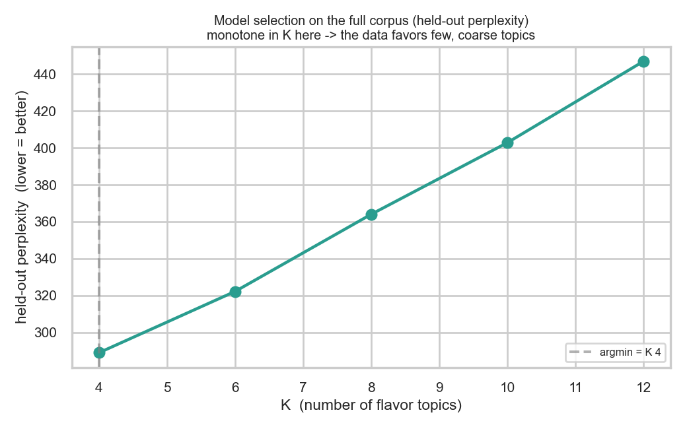
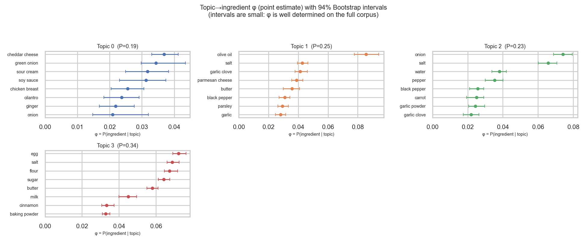

[English](README.md) | **中文**

# 今晚能做什么菜?— 贝叶斯 LDA 食谱推荐器

一个基于潜在狄利克雷分配(LDA)、在潜在"风味主题"上工作的贝叶斯推荐器。给定你手头有的配料,
它返回你能做的 Top-5 食谱,按一个融合了*覆盖率(coverage)*、*潜在风味对齐(latent-flavor
alignment)* 和 *贝叶斯平滑评分(Bayesian-smoothed rating)* 的综合分数排序——并把不确定性一路
传播到最终排名。

**模型。** 对 `φ`(主题→配料)做全贝叶斯 NUTS 拟合无法扩展到几百食谱以上,所以这里用 `sklearn`
的 `LatentDirichletAllocation` 在**全量 53k 食谱**上把 `φ` 学成**点估计**,再用 **Bootstrap**
重采样近似 `φ` 的不确定性(对食谱重采样后重拟合,作为伪样本保留)。下游每个量都*逐 `φ` 样本计算再
平均*,所以不确定性会传到最终分数;真正贝叶斯的一步是**用户的风味后验**(步骤 3),用几个配料经
贝叶斯定理推断。快(全量约 25 秒),且在关键处保持贝叶斯。

## 流程一览


*可编辑的 Mermaid 源见 [`docs/flowchart.md`](docs/flowchart.md);用 `python src/make_flowchart.py` 可重新生成 PNG。*

## 项目结构

```
model/
├── README.md · README.zh-CN.md · requirements.txt
├── src/
│   ├── recipe_recommender.py    # 模型 + 五个函数:train_lda、filter_candidates、
│   │                            #   infer_user_posterior、score_recipes、recommend
│   ├── topic_alignment.py       # Bootstrap 重拟合的匈牙利主题标签对齐
│   ├── prepare_data.py          # 下载 Food.com   ->  data/recipes_clean.csv
│   ├── run_demo.py              # 端到端 demo     ->  results.json(并训练模型)
│   ├── visualize.py             # 图              ->  figures/
│   └── make_flowchart.py        # 流程图          ->  figures/pipeline_flowchart.png
├── notebooks/
│   ├── model_pipeline.ipynb     # 端到端构建流程(已执行,内嵌图)
│   ├── usage_example.ipynb      # 单次推荐使用案例(已执行)
│   └── Data.ipynb               # 原始数据工程笔记本(spaCy)
├── tests/                       # test_alignment.py(pytest)
├── figures/                     # fig1–fig4 + pipeline_flowchart.png
├── docs/                        # presentation_script.md · flowchart.md
├── data/                        # recipes_clean.csv  (生成;已 gitignore)
├── models/                      # lda_model.pkl      (训练;已 gitignore)
├── model_selection.json         # 各 K 的留出 perplexity(fig1 背后数据)
└── results.json                 # 最近一次 demo 结果
```

五个核心函数都在 `src/recipe_recommender.py`:`train_lda`、`filter_candidates`、
`infer_user_posterior`、`score_recipes`、`recommend`。

## 快速开始

```bash
pip install scikit-learn joblib kagglehub inflect numpy pandas scipy matplotlib seaborn
python src/prepare_data.py      # -> data/recipes_clean.csv
python src/run_demo.py          # 训练(全量,约 25–60 秒) + 推荐
# 或作为库使用:
python src/recipe_recommender.py --ingredients chicken garlic onion tomato rice salt
```

```python
import sys; sys.path.insert(0, "src")          # 在 model/ 目录下运行
import pandas as pd, recipe_recommender as rr
df = pd.read_csv("data/recipes_clean.csv")
rr.recommend(["chicken", "garlic", "onion", "tomato", "rice", "salt"], df)
```

> **注意:** `data/recipes_clean.csv` 和 `models/lda_model.pkl` 已被 **gitignore**(大 / 可重新生成)。
> 先跑 `python src/prepare_data.py` 再跑 `python src/run_demo.py` 生成一次即可——notebook 会载入
> `models/lda_model.pkl`。已提交的 notebook 已内嵌输出与图,所以在 GitHub 上无需运行即可查看。

## 五个步骤

### 步骤 1 — `train_lda()`:sklearn 点估计 φ + Bootstrap 伪后验

`train_lda(df, ...) -> LDAModel`。模型保留 `phi_samples`(Bootstrap 伪后验),下游所有量都在它上面做平均。

1. **点估计。** 在**全量语料**上跑一次 `sklearn.decomposition.LatentDirichletAllocation` → `φ̂`
   (`components_` 行归一化)。文档-词矩阵的词表 = 按文档频率排序的 top `vocab_top_n` 个配料。
2. **Bootstrap 伪后验。** 对食谱重采样(m-out-of-n,`m≈10k`)重拟合 `B=50` 次,每次从 `φ̂`
   **warm start** 并跑几轮 online 更新;这 `B` 个对齐后的拟合作为 `phi_samples`,于是"不确定性传播"
   这一卖点仍贯穿步骤 3–5。
3. **标签对齐。** 每次重拟合的主题编号是乱的,所以用**余弦相似度上的匈牙利算法**
   (`topic_alignment.align_phi`)把每个 `φ̂_b` 重排回 `φ̂`。对齐后 `phi_samples[:, k, :]` 跨样本
   是同一个"主题 k",下游 KL 才有意义。
4. **用留出 perplexity 选 K**,在 `K ∈ {4,6,8,10,12}` 上(训练 90% / 打分 10%)。*诚实结论:*
   这里 perplexity 对 `K` **单调递增**,所以选了最小的(`K=4`)——数据本身就偏好少而粗的主题。
   想要更丰富的 `flavor_tags` 时 `K` 可被覆盖(`train_lda(df, K=6)`);推荐结果对 `K` 稳健,因为
   覆盖率与评分主导分数。

> **诚实的注意事项 —— `φ` 是点估计。** Bootstrap 的离散度是**重采样稳定性(bootstrap stability)**,
> 不是贝叶斯后验:在大语料上 `φ` 被很好地确定,所以它*天然*就很小(`φ` 每元素平均标准差 ≈ `5e-4`)。
> 因此我们把它报告为*稳定性*而非*后验不确定性*,输出里的 `posterior_uncertainty` ≈ 0。这个近似之所以
> 合理,**正是因为** 53k 食谱下 `φ` 几乎没有不确定性;真正不确定的量是*用户*的主题后验(步骤 3,只有
> 几个配料),而**那一部分保持全贝叶斯**。

超参以 sklearn 的 Dirichlet 先验进入:`alpha = doc_topic_prior = 0.1`(每食谱稀疏主题混合),
`beta = topic_word_prior = 0.01`(每主题稀疏配料集)。

### 步骤 2 — `filter_candidates()`
`coverage = |user ∩ recipe| / |recipe|`。保留 `coverage ≥ 0.7`;若存活的食谱少于 20 个,
放宽到 `0.5`。两侧配料都经过同一个归一化器,集合交集才有意义。

### 步骤 3 — `infer_user_posterior()`:风味主题上的后验
把用户的配料当作证据,**对 `φ` 的每个样本**应用贝叶斯定理:

```
P(topic=k | ingredients) ∝ P(ingredients | topic=k) · P(topic=k)
P(ingredients | topic=k)  = Π_i phi[k, i]
P(topic=k)                = 经验边缘主题频率(平均食谱主题混合)
```

我们对每个 Bootstrap 样本都算一遍并保留逐样本后验,这样"风味画像"就携带了不确定性,而不是坍缩成
点估计。这是真正贝叶斯的一步:聚焦菜篮的主题后验是尖峰(确定),模糊菜篮则分散(不确定)。步骤 4 用
*同一个*函数来刻画每个食谱。

### 步骤 4 — `score_recipes()`:综合分数
```
score = coverage^2 · overlap_bonus · flavor_alignment^1 · rating_prior^1
```
- **coverage^2** —— 主导项;做不出来的食谱毫无用处。
- **overlap_bonus** = `1 − exp(−|user ∩ recipe| / τ)`,`τ=4`。coverage 是个*比例*,所以
  2–3 个配料的食谱轻松就拿到 1.0;这个在*绝对*匹配配料数上饱和的奖励项会压低那些平凡匹配,
  并奖励真正匹配更多的食谱(真实的 6/7 胜过凑数的 3/3)。
- **flavor_alignment** = `exp(−KL(recipe_topics ‖ user_topics))`,逐 Bootstrap 样本计算
  (食谱与用户后验按 draw 配对)再平均。其逐样本**标准差**作为 `posterior_uncertainty` 报告
  (Bootstrap *稳定性*;因 `φ` 被很好确定而 ≈0)。
- **rating_prior** —— Beta-Binomial / 收缩平滑
  `(avg·n + μ_global·κ) / (n + κ)`,`κ=5`;评分数少的食谱向全局均值收缩。

### 步骤 5 — `recommend()`
返回 Top-N,每条是一个 dict:
```python
{
  "recipe_name": str,
  "score": float,
  "coverage": "5/6 ingredients",
  "missing_ingredients": [...],
  "flavor_tags": [...],            # top-2 主题标签
  "predicted_rating": float,
  "posterior_uncertainty": float, # 风味对齐在 Bootstrap 样本上的标准差
}
```

**面向用户的选项。** `recommend(pantry, df, **opts)` 接受:

| 选项 | 默认 | 作用 |
|------|------|------|
| `top_n` | `5` | 返回多少条食谱 |
| `exclude` | `None` | 食谱**不得**含有这些配料中的任何一个 |
| `must_use` | `None` | 食谱**必须**含有这些配料的全部 |
| `diet` | `None` | `"vegetarian"` / `"vegan"` —— 丢弃含禁用配料的食谱(`DIET_BLOCKLIST`,可编辑)。素食判定可靠;纯素较*保守*(它也会因"milk"一词误伤如"coconut milk")。 |
| `diversity` | `0.0` | `0..1` 的 MMR 重排:用分数对"与已选食谱的 Jaccard 相似度"做权衡,让列表不全是近似菜。`0`=纯按分数,`~0.4`=明显更多样。 |

```python
rr.recommend(pantry, df, diet="vegetarian", must_use=["tomato"], top_n=8)
rr.recommend(pantry, df, diversity=0.5)          # 让 Top-5 分散到不同菜型
# 命令行: python src/recipe_recommender.py --ingredients ... --diet vegan --diversity 0.5 --top-n 8
```
匹配用的是与 coverage 相同的归一化配料 token,因此保持一致。

## 可视化(`python visualize.py`)

全部用缓存模型(`models/lda_model.pkl`)生成 —— 无需重训,几秒完成。

**模型选择 —— 各 K 的留出 perplexity**



*留出 perplexity(越低越好)在本语料上对 K 单调,所以数据偏好少而粗的主题;想要更丰富的主题可覆盖 K。*

**主题→配料 φ(点估计,94% Bootstrap 区间)**



*Bootstrap"稳定性"带很窄 —— `φ` 在全量语料上被很好地确定。*

**步骤 3 —— 用户的风味后验**


*`P(topic | pantry)`:意式菜篮坍缩到单一主题(确定),烘焙菜篮分裂在两个主题之间(确有不确定性)
—— 这正是贝叶斯的一步。*

**不确定性传播到排名**


*Top-5 的逐 Bootstrap 样本风味对齐 —— `φ` 的 Bootstrap 一路传到了最终分数(因 φ 确定而很窄)。*

## 设计决策与诚实的注意事项

- **`φ` 是点估计(核心取舍)。** 全贝叶斯 NUTS 无法扩展到约 5 万食谱 × 数千配料,所以 `φ` 用 sklearn
  在全量语料上拟合一次,其不确定性用 **Bootstrap** 近似。代价:Bootstrap 的离散度是*稳定性*而非真后验,
  且因 `φ` 在大规模下被很好确定而很小(`posterior_uncertainty` ≈ 0)。理由:真正重要的不确定性是*用户*
  的主题后验(步骤 3,几个配料),它**保持全贝叶斯**。
- **Bootstrap 标签对齐。** 每次 Bootstrap 重拟合的主题是任意排序的;`topic_alignment.align_phi`
  用余弦相似度上的匈牙利算法把每个 `φ̂_b` 重排回 `φ̂`,使 `phi_samples[:, k, :]` 跨样本是同一个主题 `k`。
- **主题数受语料约束。** 留出 perplexity 在本语料上对 K 单调(偏好最小候选),所以默认是粗的
  `flavor_tags`;想要更丰富就调大 `K`(或 `vocab_top_n`)。推荐结果对 `K` 稳健,因为覆盖率与评分主导。
- **后端说明。** `recommend()` 在首次调用时惰性训练并缓存模型(以 DataFrame 为键);传 `retrain=True`
  或不同的 `train_kwargs` 可重新拟合。`sklearn` / `joblib` 惰性导入,所以导入模块很轻、Bootstrap 子进程
  启动便宜。
- **性能。** 配料归一化是热点路径,所以 `normalize_token` 加了 `lru_cache`(约 47.4 万次调用收敛到约
  7 千个不同字符串),目录的归一化列表也按 DataFrame 缓存。一次热的 `recommend()` 约 0.05 秒。全量训练
  在固定 `K` 时约 25 秒、带 K 选择扫描时约 60 秒;Bootstrap 重拟合并行(`n_jobs`),每次只在 m-out-of-n
  重采样上跑以保持便宜。
