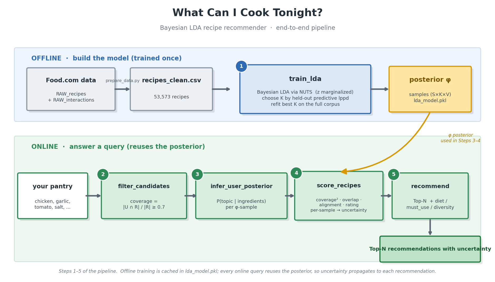
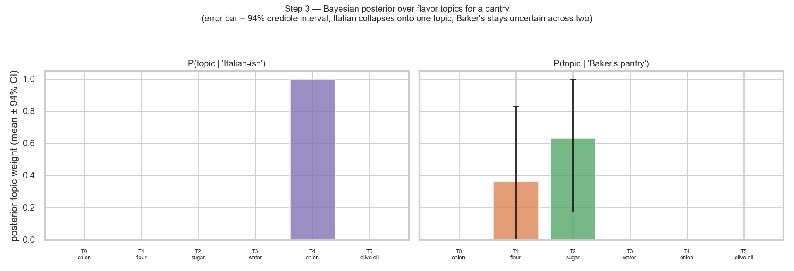
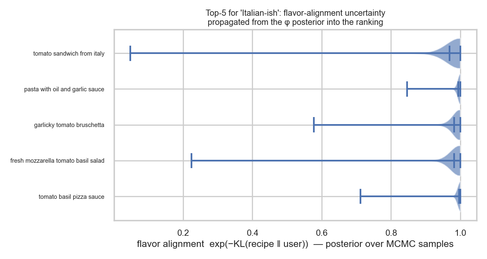

[English](README.md) | **中文**

# 今晚能做什么菜?— 贝叶斯 LDA 食谱推荐器

一个构建在 **PyMC** 上的**全贝叶斯**潜在狄利克雷分配(LDA)推荐器。给定你手头有的配料,
它返回你能做的 Top-5 食谱,按一个融合了*覆盖率(coverage)*、*潜在风味对齐(latent-flavor
alignment)* 和 *贝叶斯平滑评分(Bayesian-smoothed rating)* 的综合分数排序——并且把不确定性
从 MCMC 后验一路传播到最终排名。

## 流程一览



*可编辑的 Mermaid 源见 [`flowchart.md`](flowchart.md);用 `python make_flowchart.py` 可重新生成 PNG。*

## 项目结构

```
model/
├── recipe_recommender.py            # 模型 + 五个函数:train_lda、filter_candidates、
│                                     #   infer_user_posterior、score_recipes、recommend
├── prepare_data.py                  # 下载 Food.com   ->  recipes_clean.csv
├── run_demo.py                      # 端到端 demo     ->  results.json(并训练模型)
├── visualize.py                     # 贝叶斯图        ->  fig1–fig4 PNG
├── make_flowchart.py                # 流程图          ->  pipeline_flowchart.png
├── model_pipeline.ipynb             # 端到端构建流程(已执行,内嵌图)
├── usage_example.ipynb              # 单次推荐使用案例(已执行)
├── Data.ipynb                       # 原始数据工程笔记本(spaCy)
├── fig1_model_selection.png · fig2_topic_phi_posterior.png
├── fig3_user_topic_posterior.png · fig4_recommendation_uncertainty.png · pipeline_flowchart.png
├── presentation_script.md           # 约 5 分钟中英双语演讲稿
├── flowchart.md                     # 可编辑的 Mermaid 流程图
├── model_selection.json             # fig1 背后的 K-sweep 数据
├── results.json                     # 最近一次 demo 结果
├── requirements.txt · README.md · README.zh-CN.md
├── recipes_clean.csv                # 由 prepare_data.py 生成(已 gitignore)
└── lda_model.pkl                    # 由 run_demo.py 训练(已 gitignore)
```

五个核心函数都在 `recipe_recommender.py`:`train_lda`、`filter_candidates`、
`infer_user_posterior`、`score_recipes`、`recommend`。

## 快速开始

```bash
pip install pymc arviz nutpie kagglehub inflect numpy pandas scipy
python prepare_data.py          # -> recipes_clean.csv
python run_demo.py              # 训练 + 推荐
# 或作为库使用:
python recipe_recommender.py --ingredients chicken garlic onion tomato rice salt
```

```python
import pandas as pd, recipe_recommender as rr
df = pd.read_csv("recipes_clean.csv")
rr.recommend(["chicken", "garlic", "onion", "tomato", "rice", "salt"], df)
```

> **注意:** `recipes_clean.csv` 和 `lda_model.pkl` 已被 **gitignore**(大 / 可重新生成)。
> 先跑 `python prepare_data.py` 再跑 `python run_demo.py` 生成一次即可——notebook 会载入
> `lda_model.pkl`。已提交的 notebook 已内嵌输出与图,所以在 GitHub 上无需运行即可查看。

## 五个步骤

### 步骤 1 — `train_lda()`:NUTS 采样的贝叶斯 LDA,用留出预测似然选 K
生成式模型:

```
phi_k   ~ Dirichlet(beta=0.01)        # 每个主题上稀疏的配料分布
theta_m ~ Dirichlet(alpha=0.1)        # 每个食谱上稀疏的主题混合
w_mn    ~ Categorical(theta_m @ phi)  # 观测到的配料
```

**为什么用 `theta_m @ phi` 而不是显式的 `z_mn`?** 经典做法先采一个离散主题
`z_mn ~ Categorical(theta_m)`,再 `w_mn ~ Categorical(phi_z)`。NUTS 是基于梯度的采样器,
无法在离散潜变量上移动,所以我们把 z **解析地边缘化掉**——
`p(w | theta, phi) = Σ_k theta_k phi_k = (theta @ phi)`。这是*同一个*模型,只是把 z 积分掉了,
只留下连续的单纯形变量给 NUTS。我们保留 `phi` 和 `theta` 的**完整后验**(是样本,不是点估计)。

**用留出预测似然选 K。** WAIC 和 PSIS-LOO 都是*样本内*准则;对这个灵活的边缘化 LDA 来说,
它们会随 `K` 增大持续变好(主题越多越能拟合训练 token)——没有干净的内部最优,而过大的
`p_waic`/`p_loo` 或大量超过 arviz `good_k` 阈值的 Pareto-`k` 只是在提示复杂度惩罚已不可信。
于是我们**样本外**选 `K`:留出 15% 的配料 token,每个 `K` 在其余 token 上拟合,胜者最大化
留出预测密度 `Σ_n log mean_s p(w_n | θ, φ)`。只会"背下"训练 token 的主题对预测留出 token 没帮助,
所以这个准则会在有限的 `K` 处出现峰值。WAIC 和 PSIS-LOO(带 Pareto-`k` 可靠性检查)仍在训练
token 上计算并**作为诊断报告**。胜出的 `K` 随后**在全语料上重拟合**。这三个准则都只依赖于
标签不变的似然 `theta @ phi`,因此可以安全地汇总所有链。*(arviz 1.x 移除了独立的 `waic()`;
WAIC 直接从后验样本计算,PSIS-LOO 通过 `az.loo`。)*

### 步骤 2 — `filter_candidates()`
`coverage = |user ∩ recipe| / |recipe|`。保留 `coverage ≥ 0.7`;若存活的食谱少于 20 个,
放宽到 `0.5`。两侧配料都经过同一个归一化器,集合交集才有意义。

### 步骤 3 — `infer_user_posterior()`:风味主题上的后验
把用户的配料当作证据,**对 phi 的每个后验样本**应用贝叶斯定理:

```
P(topic=k | ingredients) ∝ P(ingredients | topic=k) · P(topic=k)
P(ingredients | topic=k)  = Π_i phi[k, i]
P(topic=k)                = 经验边缘主题频率(平均食谱主题混合)
```

我们对每个 MCMC 样本都算一遍,并保留逐样本后验,这样"风味画像"就携带了模型的不确定性,
而不是坍缩成一个点估计。步骤 4 用*同一个*函数来刻画每个食谱。

### 步骤 4 — `score_recipes()`:综合贝叶斯分数
```
score = coverage^2 · overlap_bonus · flavor_alignment^1 · rating_prior^1
```
- **coverage^2** —— 主导项;做不出来的食谱毫无用处。
- **overlap_bonus** = `1 − exp(−|user ∩ recipe| / τ)`,`τ=4`。coverage 是个*比例*,所以
  2–3 个配料的食谱轻松就拿到 1.0;这个在*绝对*匹配配料数上饱和的奖励项会压低那些平凡匹配,
  并奖励真正匹配更多的食谱(真实的 6/7 胜过凑数的 3/3)。
- **flavor_alignment** = `exp(−KL(recipe_topics ‖ user_topics))`,逐 MCMC 样本计算
  (食谱与用户后验按 draw 配对)再平均。其逐样本**标准差**作为 `posterior_uncertainty` 报告。
- **rating_prior** —— Beta-Binomial / 收缩平滑
  `(avg·n + μ_global·κ) / (n + κ)`,`κ=5`;评分数少的食谱向全局均值收缩。

### 步骤 5 — `recommend()`
返回 Top-N,每条是一个 dict:
```python
{
  "recipe_name": str,
  "score": float,
  "coverage": "5/6 ingredients",
  "missing_ingredients": [...],
  "flavor_tags": [...],            # 后验给出的 top-2 主题标签
  "predicted_rating": float,
  "posterior_uncertainty": float, # 风味对齐在 MCMC 样本上的标准差
}
```

**面向用户的选项。** `recommend(pantry, df, **opts)` 接受:

| 选项 | 默认 | 作用 |
|------|------|------|
| `top_n` | `5` | 返回多少条食谱 |
| `exclude` | `None` | 食谱**不得**含有这些配料中的任何一个 |
| `must_use` | `None` | 食谱**必须**含有这些配料的全部 |
| `diet` | `None` | `"vegetarian"` / `"vegan"` —— 丢弃含禁用配料的食谱(`DIET_BLOCKLIST`,可编辑)。素食判定可靠;纯素较*保守*(它也会因"milk"一词误伤如"coconut milk")。 |
| `diversity` | `0.0` | `0..1` 的 MMR 重排:用分数对"与已选食谱的 Jaccard 相似度"做权衡,让列表不全是近似菜。`0`=纯按分数,`~0.4`=明显更多样。 |

```python
rr.recommend(pantry, df, diet="vegetarian", must_use=["tomato"], top_n=8)
rr.recommend(pantry, df, diversity=0.5)          # 让 Top-5 分散到不同菜型
# 命令行: python recipe_recommender.py --ingredients ... --diet vegan --diversity 0.5 --top-n 8
```
匹配用的是与 coverage 相同的归一化配料 token,因此保持一致。

## 可视化(`python visualize.py`)

全部用缓存后验(`lda_model.pkl`)生成 —— 无需重训,几秒完成。

**模型选择 —— 为什么样本外选 K**


*留出预测 lppd(绿色)在较小的 K 处达到峰值,而样本内的 WAIC/LOO(右轴)随 K 持续"变好"
—— 典型的过拟合特征。所以 K 要样本外选。*

**主题→配料后验 φ(94% 可信区间)**


*"全贝叶斯"视角:我们保留的是 φ 的后验分布,而不是点估计。*

**步骤 3 —— 用户的风味后验**



*`P(topic | pantry)`(均值 ± 94% CI):意式菜篮坍缩到单一主题(确定),
烘焙菜篮分裂在两个主题之间(确有不确定性)—— 同一套机制,确定性不同。*

**不确定性传播到排名**



*Top-5 的逐 MCMC 样本风味对齐 —— φ 后验的不确定性一路传到了最终分数。*

## 设计决策与诚实的注意事项

- **规模。** 全贝叶斯 NUTS 无法扩展到约 5 万食谱 × 数千配料。`train_lda` 在一个可控的
  **食谱子样本**和一个 **top-N 配料词表**上拟合 `phi`;整个目录里每个食谱、每个用户的主题画像
  随后通过步骤 3 的贝叶斯更新从 `phi` 后验得到(快,且与用户侧计算一致)。提高 `n_train`、
  `vocab_size`、`draws` 可换取更高保真度,代价是运行时间。
- **主题数受语料约束。** 因为 `K` 是*样本外*选的,它只能大到训练语料真正支撑得起的程度——
  小的 `n_train` 会诚实地选出很少的主题(`flavor_tags` 较粗)。想要更丰富的主题,就调高
  `n_train`/`vocab_size` 让留出准则能支撑更大的 `K`;这要拿运行时间来换(NUTS 随 `theta` 的
  维度 `M×K` 变重)。
- **标签切换(label switching)。** 主题可交换,所以主题标签跨链不可比。似然 `theta @ phi`
  *是*标签不变的,因此 WAIC、PSIS-LOO 和留出预测都汇总所有链;一切与主题相关的量(保留的后验、
  主题间 KL)**以及报告的 `ESS`** 都只用**单条链**,在其中标签保持一致。`phi` 的跨链 ESS/r-hat
  会纯粹因标签切换而被压低,报告它会低估收敛——故按单链计算。
- **采样器。** 使用 `nutpie`(numba 后端),因为没有 C/C++ 编译器可供 PyTensor 的默认后端使用。
  每个模型首次编译约需 1–2 分钟。
- **后端说明。** `recommend()` 在首次调用时惰性训练并缓存模型(以 DataFrame 为键);传
  `retrain=True` 或不同的 `train_kwargs` 可重新拟合。
- **性能。** 配料归一化是热点路径,所以 `normalize_token` 加了 `lru_cache`(约 47.4 万次调用
  收敛到约 7 千个不同字符串),目录的归一化列表也按 DataFrame 缓存。一次 `recommend()` 冷调用
  约 2 秒、热调用约 0.05 秒(此前每次都要约 38 秒)。传单一 `k_values=(K,)` 会跳过留出诊断拟合,
  只做一次 NUTS 拟合。NUTS 拟合本身是唯一固有开销;它随训练*文档*数(`n_train`)超线性增长,
  所以让 `n_train` 保持适中(约 400),改去加大 `vocab_size`(代价小)。
