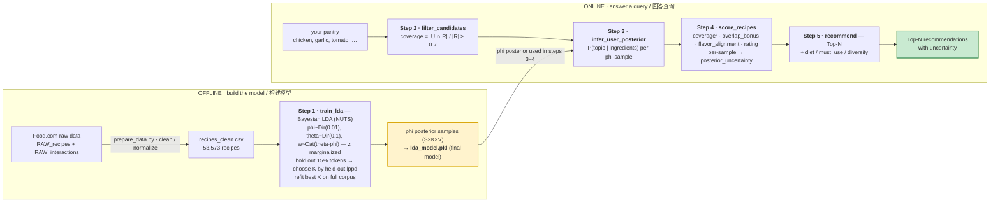

# 流程图 / Pipeline flowchart

Two equivalent forms: a rendered **PNG** (for slides / any viewer) and an editable
**Mermaid** source (GitHub renders it inline). Same pipeline either way.

*Regenerate the PNG with `python make_flowchart.py` (run from the repo root).*

---

## Editable source (Mermaid)

